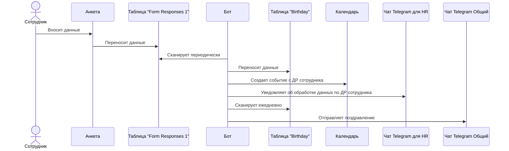
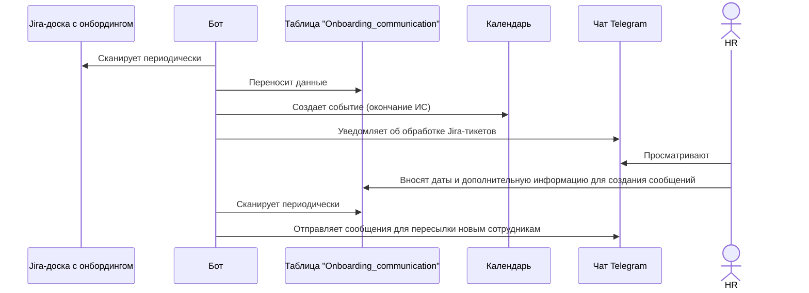
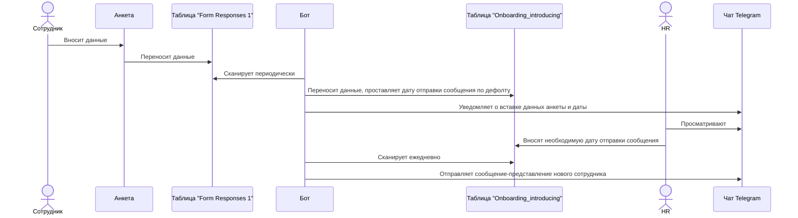

# HR Helper Bot

A comprehensive automation bot for HR processes that handles employee onboarding, birthday celebrations, offboarding, and user form processing through Google Sheets integration and Telegram notifications.

ДР


Онбординг-коммуникация


Онбординг-представление


Оффбординг
```mermaid
sequenceDiagram
  participant J as Jira-доска с онбордингом
  participant B as Бот
  participant T as Таблица "Onboarding_communication"
  participant C as Календарь
  participant TG as Чат Telegram
  actor HR as HR

  B ->> J: Сканирует периодически
  B ->> T: Переносит данные
  B ->> C: Создает событие (окончание ИС)
  B ->> TG: Уведомляет об обработке Jira-тикетов
  HR ->> TG: Просматривают
  HR ->> T: Вносят даты и дополнительную информацию для создания сообщений
  B ->> T: Сканирует периодически
  B ->> TG: Отправляет сообщения для пересылки новым сотрудникам
  ```

## 🚀 Features

- **Birthday Management**: Automated birthday greetings with calendar integration
  - Daily birthday notifications to team chats
  - Automatic calendar event creation for birthdays
  - Calendar cleanup when employees leave
- **Employee Onboarding**: Comprehensive welcome workflow
  - Personalized AI-generated introduction messages
  - Multi-stage communication process
  - Integration with Google Sheets for data tracking
  - JIRA integration for onboarding workflow synchronization
- **Employee Offboarding**: Complete departure process automation
  - Personal farewell messages to departing employees
  - Group notifications about team changes
  - Automatic birthday event removal from calendar
  - JIRA integration for offboarding workflow synchronization
- **Probation Management**: Employee probation period tracking (integrated with onboarding)
  - Automated probation end date reminders
  - Calendar event creation for probation deadlines
  - JIRA-based probation tracking through onboarding workflow
- **User Form Processing**: Streamlined new employee data handling
  - Automated form data extraction and validation
  - Birthday data synchronization with calendar
  - Onboarding record creation and tracking
  - Name extraction using AI for data cleanup
- **Google Sheets Integration**: Real-time data processing and updates
  - Automatic timestamp recording for task executions
  - Dynamic data reading and writing
  - Multi-sheet support with configurable mappings
- **Google Calendar Integration**: Comprehensive event management
  - Annual birthday event creation
  - Event deletion for departing employees
  - Calendar sharing with service accounts
- **Telegram Bot Integration**: Reliable messaging with fallback
  - Message retry mechanisms
  - Fallback to reserved chat on failure
  - Rich message formatting and previews
- **LLM Integration**: AI-powered content generation
  - Personalized message creation
  - Name extraction from form data
  - Context-aware content generation
- **Task Automation**: Robust background processing
  - Celery-based task queue
  - Configurable scheduling intervals
  - Comprehensive error handling and logging

## 🏗️ Project Structure

```
hr-helper-bot/
├── src/                                     # Main source code
│   ├── tasks/                              # Task modules
│   │   ├── birthday/                      # Birthday management
│   │   ├── onboarding/                     # Employee onboarding
│   │   ├── offboarding_jira/               # JIRA offboarding synchronization
│   │   ├── offboarding_messages/           # Offboarding message generation
│   │   ├── onboarding_communication/       # Multi-stage onboarding
│   │   ├── onboarding_jira/                # JIRA onboarding synchronization
│   │   └── user_form/                      # User form processing
│   ├── utils/                              # Common utilities
│   │   └── task_utils.py                  # Task utility functions
│   ├── llm/                                # LLM integration
│   │   └── llm_client.py                  # LLM client implementation
│   ├── google_sheets.py                    # Google Sheets API client
│   ├── google_calendar.py                  # Google Calendar API client
│   ├── jira_client.py                      # JIRA API client
│   ├── redis_client.py                     # Redis client for caching
│   ├── tg_bot.py                           # Telegram bot functionality
│   ├── logger.py                           # Logging configuration
│   ├── config.py                           # Application configuration
│   └── celery_app.py                       # Celery task queue setup
├── templates/                               # Message templates
│   └── messages/                           # Task-specific message templates
│       ├── birthday/                      # Birthday message templates
│       ├── offboarding/                    # Offboarding message templates
│       ├── onboarding/                     # Onboarding message templates
│       └── onboarding_communication/       # Onboarding communication templates
├── scripts/                                 # Utility scripts
│   ├── fill_in_the_birthday_calendar.py   # Birthday calendar population script
│   └── extract_messages_from_photo.py     # Message extraction from images
├── tests/                                   # Test suite
│   ├── conftest.py                         # Common test fixtures
│   ├── test_birthday_task.py               # Birthday task tests
│   ├── test_onboarding_task.py             # Onboarding task tests
│   ├── test_offboarding_jira_task.py       # JIRA offboarding tests
│   ├── test_offboarding_messages_task.py   # Offboarding messages tests
│   ├── test_onboarding_communication_task.py  # Communication tests
│   ├── test_onboarding_jira_task.py        # JIRA onboarding tests
│   └── test_user_form_task.py              # User form tests
├── docker/                                  # Docker configuration
│   ├── Dockerfile                          # Application container
│   └── docker-compose.local.yml            # Local development compose
├── data/                                    # Data files
│   └── service_account_credentials.json    # Google service account
├── .env.template                            # Environment variables template
├── pyproject.toml                           # Project configuration
├── uv.lock                                  # Dependency lock file
└── README.md                                # This file
```

### Task Module Structure

Each task directory contains the following standard components:

- **`models.py`** - Data models and structures for the task
- **`reader.py`** - Google Sheets data reading and parsing
- **`task.py`** - Main Celery task implementation and orchestration
- **`message_generator.py`** or **`message_builder.py`** - Message creation and formatting
- **`utils.py`** - Task-specific utility functions (if needed)
- **`calendar_manager.py`** - Google Calendar operations (for tasks requiring calendar integration)
- **`sheets_manager.py`** - Google Sheets operations specific to the task
- **`redis_manager.py`** - Redis operations for state management (for JIRA sync tasks)

## 🔧 Local Development Setup

### Prerequisites

- Docker and Docker Compose
- Python 3.12+
- UV package manager
- Google Cloud Project with enabled APIs:
  - Google Sheets API
  - Google Calendar API
- Service account with appropriate permissions

### 1. Environment Configuration

Copy the environment template and configure your variables:

```bash
cp .env.template .env
```

#### Environment Variables

| Variable | Description | Required | Default | Example |
|----------|-------------|----------|---------|---------|
| **Application Settings** |
| `ENVIRONMENT` | Application environment | No | `dev` | `dev`, `prod` |
| `TIMEZONE` | Application timezone | No | `Asia/Bishkek` | `UTC`, `Europe/London` |
| **Telegram Bot** |
| `TG_API_TOKEN` | Telegram Bot API token | Yes | - | `1234567890:ABCdefGHIjklMNOpqrsTUVwxyz` |
| `RESERVED_TG_CHAT_ID` | Default Telegram chat ID | Yes | - | `-1001234567890` |
| **Google Services** |
| `ADMIN_SHEET_URL` | Google Sheets admin URL | Yes | - | `https://docs.google.com/spreadsheets/d/...` |
| `USER_FORM_SHEET_URL` | User form sheet URL | Yes | - | `https://docs.google.com/spreadsheets/d/...` |
| `GOOGLE_CALENDAR_ID` | Google Calendar ID for events | Yes | - | `primary` or `example@gmail.com` |
| `SERVICE_ACCOUNT_CREDENTIALS_JSON` | Google service account path | No | `data/service_account_credentials.json` | `data/credentials.json` |
| **LLM Integration** |
| `LLM_API_KEY` | LLM service API key | Yes | - | `sk-...` |
| `LLM_BASE_URL` | LLM service base URL | No | `https://openrouter.ai/api/v1` | `https://api.openai.com/v1` |
| `LLM_MODEL` | LLM model name | No | `deepseek/deepseek-chat-v3-0324:free` | `gpt-3.5-turbo` |
| **JIRA Integration** |
| `JIRA_API_KEY` | JIRA API token | No | - | `ATATT3xFfGF0...` |
| `JIRA_BASE_URL` | JIRA instance base URL | No | - | `https://company.atlassian.net` |
| `JIRA_ACCOUNT_EMAIL` | JIRA account email | No | - | `user@company.com` |
| `OFFBOARDING_PROJECT_ID` | JIRA offboarding project ID | No | - | `OFF` |
| `ONBOARDING_PROJECT_ID` | JIRA onboarding project ID | No | - | `ONB` |
| `TASK_JIRA_OFFBOARDING_SYNC_COLUMN_NAME` | JIRA offboarding status column | No | - | `Offboarding (Mad Devs)` |
| `TASK_JIRA_ONBOARDING_SYNC_COLUMN_NAME` | JIRA onboarding status column | No | - | `Job offer accepted` |
| **Task Scheduling** |
| `TASK_BIRTHDAY_EXECUTION_TIME` | Birthday task execution time | No | `10:00` | `09:30`, `14:00` |
| `TASK_ONBOARDING_EXECUTION_INTERVAL_MINUTES` | Onboarding task interval | No | `10` | `5`, `15` |
| `TASK_OFFBOARDING_EXECUTION_INTERVAL_MINUTES` | Offboarding task interval | No | `10` | `5`, `15` |
| `TASK_ONBOARDING_COMMUNICATION_EXECUTION_INTERVAL_MINUTES` | Communication task interval | No | `10` | `5`, `15` |
| `TASK_USER_FORM_EXECUTION_INTERVAL_MINUTES` | User form task interval | No | `10` | `5`, `15` |
| `TASK_JIRA_OFFBOARDING_SYNC_INTERVAL_MINUTES` | JIRA offboarding sync interval | No | `10` | `5`, `15` |
| `TASK_JIRA_ONBOARDING_SYNC_INTERVAL_MINUTES` | JIRA onboarding sync interval | No | `10` | `5`, `15` |
| **Celery & Redis** |
| `CELERY_BROKER_URL` | Celery broker URL (Redis) | Yes | `redis://redis:6379/0` | `redis://localhost:6379/0` |
| `CELERY_QUEUE_NAME_PREFIX` | Celery queue name prefix | No | `hr_helper_bot` | `my_app` |
| `CELERY_TASK_TIME_LIMIT_SEC` | Task execution time limit | No | `120` | `300` |
| `CELERY_RESULT_EXPIRES_SEC` | Task result expiration | No | `86400` | `3600` |
| `CELERY_WORKER_CONCURRENCY` | Worker concurrency level | No | `4` | `2`, `8` |
| `CELERY_WORKER_MAX_TASKS_PER_CHILD` | Max tasks per worker | No | `1000` | `500` |
| **Logging & Monitoring** |
| `LOG_LEVEL` | Logging level | No | `INFO` | `DEBUG`, `WARNING` |
| `WRITE_LOG_FILE` | Write logs to file | No | `true` | `false` |
| `SENTRY_DSN` | Sentry error tracking DSN | No | - | `https://...@sentry.io/...` |


### 2. Install Dependencies

```bash
# Install UV package manager
curl -LsSf https://astral.sh/uv/install.sh | sh

# Install project dependencies
uv sync --group dev
```

### 3. Google Sheets Setup

1. Create a Google Cloud Project ([guide](https://habr.com/ru/articles/825404/))
2. Enable Google Sheets API
3. Create a service account
4. Download credentials JSON file
5. Create the data directory and place credentials:
   ```bash
   mkdir -p data/
   # Place your service_account_credentials.json in data/ folder
   ```
6. Share your Google Sheets with the service account email


### 4. Google Calendar Setup

1. **Enable Google Calendar API in Google Cloud Console:**
   - Go to [Google Cloud Console](https://console.cloud.google.com/)
   - Select your project (or create a new one)
   - Navigate to "APIs & Services" > "Library"
   - Search for "Google Calendar API"
   - Click on "Google Calendar API" and press "Enable"
   - Wait for the API to be enabled

2. **Configure Service Account Permissions:**
   - Go to "APIs & Services" > "Credentials"
   - Find your service account (the same one used for Google Sheets)
   - Click on the service account email
   - Go to "Keys" tab
   - Download the JSON key file if you haven't already
   - Place it in the `data/` folder

3. **Share Calendar with Service Account:**
   - Open [Google Calendar](https://calendar.google.com/)
   - Find the calendar you want to use (or create a new one)
   - Click the three dots next to the calendar name
   - Select "Settings and sharing"
   - Scroll down to "Share with specific people"
   - Click "Add people"
   - Enter the service account email (found in your JSON credentials file)
   - Set permission to "Make changes to events"
   - Click "Send" (the service account won't receive the email, but access will be granted)

4. **Get Calendar ID:**
   - In the same "Settings and sharing" section
   - Scroll down to "Integrate calendar"
   - Copy the "Calendar ID" (it will look like `example@gmail.com` or a long string)
   - Add this ID to your `.env` file as `GOOGLE_CALENDAR_ID`

5. **Verify Setup:**
   - The service account should now have access to create, read, and modify events in your calendar
   - You can test this by running a simple calendar operation through your application


### 5. Telegram Bot Setup

1. Create a bot via [@BotFather](https://t.me/botfather)
2. Get the API token
3. Add the token to your `.env` file
4. Get your chat ID and add it to `.env`

### 6. Docker Setup

```bash
# Build and start the application
docker-compose -f docker/docker-compose.local.yml up --build
```

### 7. Manual Testing And Linter Running

```bash
# Run tests
uv run pytest tests/ -v

# Run specific test module
uv run pytest tests/test_user_form_task.py -v

# Run linter
uv run ruff check --fix .
uv run ruff format .
```

## 📋 Task Scheduling

The bot runs various tasks on configurable schedules (can be customized via environment variables):

- **Birthday Greetings**: Daily at configurable time (default: 10:00 AM)
  - Controlled by `TASK_BIRTHDAY_EXECUTION_TIME`
  - Sends birthday notifications and updates Google Sheets timestamps
- **Onboarding Messages**: Configurable interval (default: every 10 minutes)
  - Controlled by `TASK_ONBOARDING_EXECUTION_INTERVAL_MINUTES`
  - Processes new employee introduction messages
- **Offboarding Messages**: Configurable interval (default: every 10 minutes)
  - Controlled by `TASK_OFFBOARDING_EXECUTION_INTERVAL_MINUTES`
  - Handles employee departure notifications and calendar cleanup
- **Onboarding Communication**: Configurable interval (default: every 10 minutes)
  - Controlled by `TASK_ONBOARDING_COMMUNICATION_EXECUTION_INTERVAL_MINUTES`
  - Manages multi-stage onboarding communication workflow
- **User Form Processing**: Configurable interval (default: every 10 minutes)
  - Controlled by `TASK_USER_FORM_EXECUTION_INTERVAL_MINUTES`
  - Processes new employee forms and syncs data with calendar
- **JIRA Offboarding Synchronization**: Configurable interval (default: every 10 minutes)
  - Controlled by `TASK_JIRA_OFFBOARDING_SYNC_INTERVAL_MINUTES`
  - Synchronizes offboarding issues from JIRA to Google Sheets
  - Filters issues by status and extracts employee data automatically
  - Uses Redis for sync state management and Telegram login normalization
- **JIRA Onboarding Synchronization**: Configurable interval (default: every 10 minutes)
  - Controlled by `TASK_JIRA_ONBOARDING_SYNC_INTERVAL_MINUTES`
  - Synchronizes onboarding issues from JIRA to Google Sheets
  - Creates probation period calendar events automatically
  - Uses Redis for sync state management and early exit optimization

All tasks automatically record execution timestamps in their respective Google Sheets for tracking and debugging purposes.
